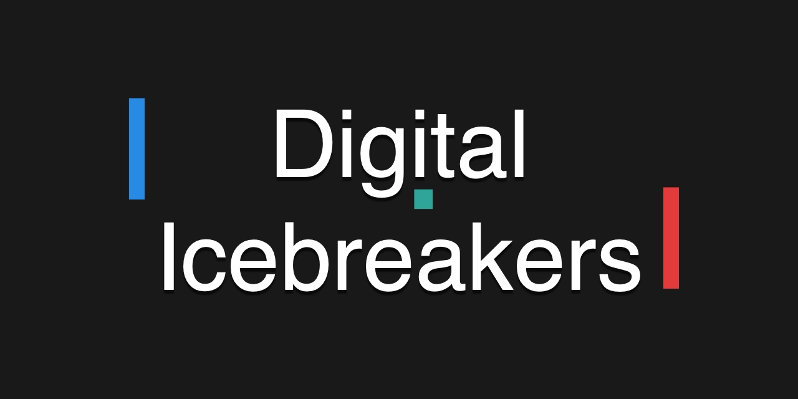

# Digital Icebreakers



Digital Icebreakers is a platform for presenters and audiences to collaborate, play, and experiment together.

## How it works

A presenter creates a _Lobby_ and audience members join by pointing their phone cameras at the presenter's screen and scanning the QR code. The presenter can then guide the audience through games and experiences by clicking _New Activity_. Try it out on [digitalicebreakers.com](https://digitalicebreakers.com).

## Architecture

A React SPA backed by Firebase Realtime Database — there is no application server. The presenter's browser is the game-state authority: it aggregates player input (votes, answers, paddle speeds), balances teams, and publishes results back to RTDB for players. Anonymous Firebase auth identifies clients; [security rules](web/database.rules.json) ensure only the lobby creator can write presenter-owned paths and players can only write their own input. Idle lobbies are cleaned up after an hour.

In development everything runs against the local Firebase emulator — no Firebase project or credentials required.

## Getting started

Prerequisites: [Node 22+](https://nodejs.org) and Java (required by the Firebase emulator; on macOS `brew install openjdk`).

```bash
cd web
npm install
npm run dev    # vite dev server (5173) + firebase emulators (9000/9099)
```

Open http://localhost:5173, click _Present_ → _Create_, then open the QR-code link in a second (incognito) window to join as a player.

## Testing

```bash
npm test             # unit tests (vitest)
npm run test:rules   # database security-rules tests (runs against the emulator)
npm run e2e          # end-to-end tests (playwright; starts its own servers)
```

## Creating your own game

A game is two React components registered in `web/src/games/Games.ts`:

1. `[GameName]Client.tsx` — the player view; sends input with `sendClientMessage`.
2. `[GameName]Presenter.tsx` — the presenter view; receives player messages and owns the game state.

Game state lives in Jotai atoms (`[gameName]Atoms.ts`) which register a handler for incoming messages via `registerGame(name, atom, handler)`. Copy an existing game — `Buzzer` is the simplest — and follow the same pattern. Add an e2e spec under `web/e2e/games/` covering the presenter and client workflows.

## Deployment

Pushes to `master` build the frontend, deploy the database rules, and publish a static nginx container. The workflow expects these repository secrets: `VITE_FIREBASE_API_KEY`, `VITE_FIREBASE_PROJECT_ID`, `VITE_FIREBASE_DATABASE_URL`, `FIREBASE_TOKEN`, `DOCKERHUB_USERNAME`, `DOCKERHUB_TOKEN`, `DEPLOY_REPO_TOKEN`.

## Contributing

- Jump in and build your own games & experiences immediately!
- Suggest new features and/or games
- Post feedback on your experience while using Digital Icebreakers with your group/talk/presentation
- If you want to make architectural improvements, start a conversation first to improve the likelihood your PR is merged.

## Help

Ask here, or on [twitter](https://twitter.com/staff0rd), or [anywhere here](https://staffordwilliams.com/about/).
